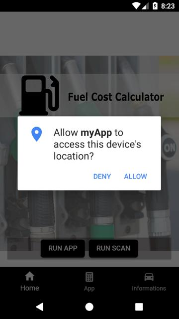

# Ionic Fuel Calculator Application

This is the Ionic demo app, showcasing a variety of Ionic Framework components and native features.

## Getting Started

* [Download the installer](https://nodejs.org/) for Node.js 6 or greater.
* Install the ionic CLI globally: `npm install -g ionic`
* Clone this repository: `git clone https://github.com/wojciechpaluch/Fuel-Calculator-Ionic.git`.
* Run `npm install` from the project root.
* Run `ionic serve` in a terminal from the project root.

## App Preview

